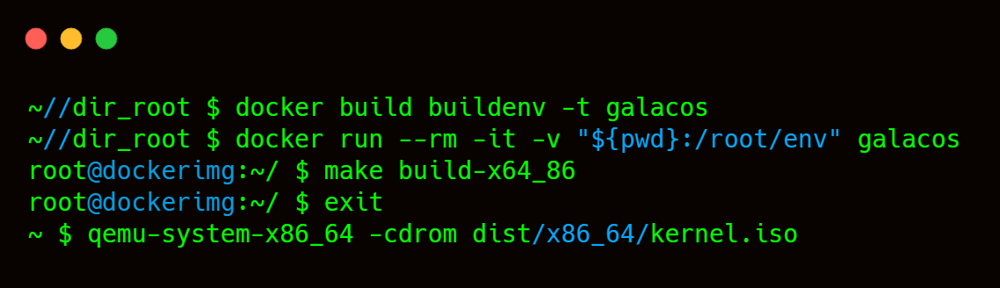

# GALACOS 2.0

## Building
- Run `docker build buildenv -t galacos` to build the docker image
- To connect to the docker image run the use one of the following:
    - Powershell: `docker run --rm -it -v "${pwd}:/root/env" galacos`
    - Command Prompt: `docker run --rm -it -v "%cd%":/root/env myos-buildenv`
    - Linux: `docker run --rm -it -v "$pwd":/root/env galacos`
- To make the os, run the command: `make build-x86_64`
- Exit the image with: `exit`
- You can then use the os with qemu with the command: `qemu-system-x86_64 -cdrom dist/x86_64/kernel.iso`

---
# TODO
- [X] Create bootloader and basic kernel;
- [ ] Create basic C IO library;
- - [X] Create int to string function `ITOA(int, base)`;
- - [X] Create Basic Output To Terminal `STRP(string)`
- - [ ] Create Basic input system;
- - - [X] Note all keycodes in input header file.
- - - [ ] Get input from `0x60`
- [ ] Create basic gui.

---
# Credits
- [Rhys Woolcott](https://github.com/Rhys-Woolcott) [ Author ]
- [Jud](https://github.com/musteat64) [ Emotional support and breaker of things that are unbreakable by literally everone else on earth ] 
